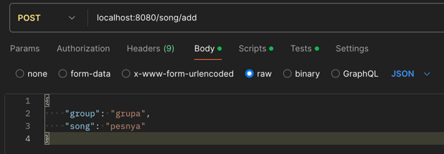
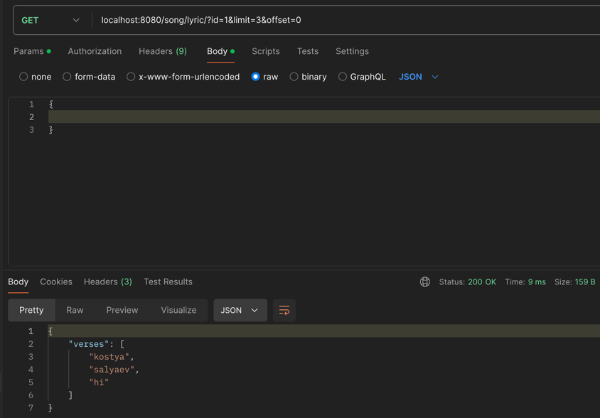
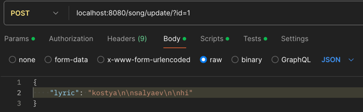

# Тестовое задание "Онлайн библиотека песен"

## Содержание
- [Задание](#задание)
- [Использование](#использование)
- [Реализация](#реализация)
    - [Дизай базы данных](#дизайн-база-данных)
    - [Структура проекта](#структура-проекта)

___
### Задание

1. Выставить rest методы
- Получение данных библиотеки с фильтрацией по всем полям и пагинацией
- Получение текста песни с пагинацией по куплетам
- Удаление песни
- Изменение данных песни
- Добавление новой песни в формате
2. Обогащенную информацию положить в БД postgres (структура БД должна быть создана путем миграций при старте сервиса)
5. Покрыть код debug- и info-логами
4. Вынести конфигурационные данные в .env-файл
5. Сгенерировать сваггер на реализованное АПИ

___
## Использование
1. Склонировать репозиторий: ```git clone https://github.com/Saljaev/songs```
<br>*Использование подразумевает наличие и использование Docker*
2. Прописать ```make start``` для запуска и ```make stop``` для остановки работы
<br>*```make start``` - ```docker-compose up --build```*
<br>*```make stop``` - ```docker-compose down```*
3. Перейти на ```localhost:8002``` для просмотра документации и использовать ```localhost:8080``` для запросов
___
## Реализация:
Написал сервис с минимальным использованием готовых библиотек (использовал лишь ```godotenv``` для .env и ```pg``` для работы с postgres).
Написал обертку для роутера и контекста, которая повышает изоляцию и безопасность, а также позволяет избавить от дублирования кода.
<br><br>
В качестве логгера использовал ```slog```, в котором есть функции разограничения уровня логов. Для смены уровня логов - нужно изменить ```level``` (.env) на желаемый (debug/info).
При написании приложения старался придерживаться принципа ```design-first```, сначала написал документацию, а потом реализовывал её на коде.
<br>
Миграции сделаны с помощью SQL, располагаются в [migrations](./internal/migrations), их использование происходит с помощью docker-compose, после того,
как контейнер с базой данных запуститься и будет готов принимать подключения - исполняются миграции.
<br>
Пагинация текста по куплетам подразумевает сохранение текста песни в формате ```verse1\n\nverse2```, что позволяет разделить их по двойному `\n`
___
### Дизайн база данных
<br>
База данных имеет 2 таблицы: ```groups``` и ```songs```, связь между ними: один и только один - один/много,
 каждая таблица имеет дополнительный индекс (поле ```name``` у ```groups``` и ```release_date``` у ```songs```) для ускорения поиска при использовании фильтрации.
Также ```songs``` имеет *constraint*: не может быть песни с одинаковым именем от одной группы (от одного ```group_id```)

___
### Структура проекта
```
cmd
└── backend
    └── main.go <- Точка входа в приложение
internal
├── api
│   ├── songs
│   │   └── ... <- Handler запросов
│   ├── context.go <- Обертка контекста
│   └── err_handler.go <- Handler для ошибок
├── app
│   └── app.go <- Код инициализации
├── migrations
│   └── ... <- Файлы миграций
├── models
│   ├── group.go <- Модель группы
│   └── songs.go <- Модель песни
└── usecase
    ├── repo
    │   └── postgres
    │       └── ... <- Файлы для работы с postgres
    └── songs.go <- Слой для взаимодействия с БД   
pkg
├── config <- Загрузка конфига с .env файла
├── query <- Декоред для url
└── router
    └── ... <- Обертка для роутера
Dockerfile
docker-compose
.env <- Переменные окружения для docker и конфигурации
```
___

## Примеры запросов
**Добавление песни**
<br>
**Получение текста с пагинацией**
<br>
**Обновление параметров песни**

